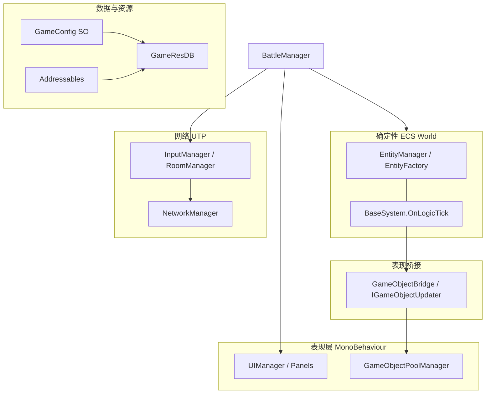

# TH10 Unity STG 开发

## 使用场景

当这个 Unity 项目的改动涉及以下内容时，使用此 Skill：

- STG/弹幕战斗逻辑、玩家/敌人行为、碰撞、发射器或关卡时间轴。
- `Assets/Scripts/ECS` 下的自制轻量 ECS + OOP 桥接架构。
- 2–4 人帧同步、输入收集、房间流程或 UTP 消息。
- Addressables、`GameResourceManifest`、`GameResDB`、ScriptableObject 配置资产或对象池。
- UI 面板、战斗准备流程或场景启动。

**配置系统专项**（`GameConfig`、`ConfigViewer`、Manifest 登记、引用解析、编辑器预览）→ [th10-config-system](../th10-config-system/SKILL.md)。

**ECS 专项**（Entity/Component/System、LogicTick、表现桥接、池化 Tag）→ [th10-ecs](../th10-ecs/SKILL.md)。

**战斗场景专项**（BattleManager、准备/开战、StageTimeline、GlobalBattleData、战斗 UI）→ [th10-battle](../th10-battle/SKILL.md)。

**2D 碰撞专项**（DeterministicGrid、CCollider、扫掠检测、CollisionLogicSystem）→ [th10-collision-2d](../th10-collision-2d/SKILL.md)。

**弹幕专项**（DanmakuEmitSystem、Line/Arc/Wave/Grain 发射、DanmakuConfig/DanmakuEmitterConfig）→ [th10-danmaku-system](../th10-danmaku-system/SKILL.md)。

**关卡出怪专项**（StageTimelineSystem、EnemyWave、Boss、CEnemyMovement）→ [th10-stage-enemy](../th10-stage-enemy/SKILL.md)。

除非用户明确要求其他语言，否则始终使用简体中文回复。

## 项目背景与技术栈

- **定位**：Unity 开发的东方 Project 类纵轴/弹幕 STG；核心玩法数据驱动，强调可复现的逻辑帧。
- **运行时架构**：自制 **ECS（实体–组件–系统）** 承载确定性战斗逻辑；**MonoBehaviour / GameObject** 负责渲染、动画、UI、音频与非确定性侧载；二者通过 `GameObjectBridge` 与 `IGameObjectUpdater` 同步。
- **联机**：**锁步帧同步**（非预测回滚）。逻辑帧率由 `GameManager.logicFPS`（默认 60）与 `LogicFrameDriver` 驱动；`BattleManager.Update` 在多人模式下收集并广播输入，待 `InputManager.AreAllInputsReady` 后再调用 `World.LogicTick`。
- **资源**：**Addressables** 加载与分组；运行时热点访问走 **`GameResDB`** 索引（配置、预制体 id 等）。
- **网络**：**Unity Transport (UTP)** 自建协议；消息为实现 `INetworkMessage` 的结构体（见 `NetworkMessages.cs`）。未使用 Netcode for GameObjects。
- **数据**：**双层配置**——`GameConfig`（SO，运行时权威）+ `GameConfigViewerBase`（预制体 MonoBehaviour，仅编辑器编辑/预览）。启动时 `GameResDB` 赋 `configIndex`，经 **`IReferenceResolver`** / **`ILogicTimingBake`** 烘焙后供 ECS 按索引访问。详见 [th10-config-system](../th10-config-system/SKILL.md)。

### Unity 包与工具（`Packages/manifest.json`）

| 类别 | 包 |
|------|-----|
| 资源 | `com.unity.addressables` 1.21.21 |
| 网络 | `com.unity.transport` 2.3.0 |
| UI/文本 | `com.unity.ugui` 1.0.0，`com.unity.textmeshpro` 3.0.9 |
| 其他常用 | `com.unity.timeline` 1.7.7，`com.unity.feature.2d` 2.0.1，`com.unity.visualscripting` 1.9.4 |
| 编辑器 | Rider / Visual Studio 集成，`com.unity.test-framework` |

异步加载使用 **`System.Threading.Tasks`**；fire-and-forget 使用 **`AsyncHelper.Forget`**（非 UniTask）。

## 架构鸟瞰

## 项目地图

- `Assets/Scripts/ECS`：自制 ECS 核心。`World` 持有 `EntityManager`、`EntityFactory`、`GameObjectBridge`、`LogicFrameDriver` 和已注册的 `BaseSystem` 实例。
- `Assets/Scripts/BattlePart`：战斗入口、逻辑帧推进、战斗区域工具、玩家生成流程。
- `Assets/Scripts/SO`：`GameConfig` 子类、`ConfigViewer/` 编辑器预览基础设施、各 `*ConfigViewer` / `*ConfigEditor`。
- `Assets/Scripts/ECS/Presentation`：逻辑帧间表现插值（`PresentationMotion`、`CPresentationPose`）。
- `Assets/Scripts/Resource`：Addressables 封装、清单加载、运行时索引化资源数据库。
- `Assets/Scripts/Pool`：`GameObjectPoolManager` 与 `IPoolable` 预制体复用。
- `Assets/Scripts/Network`：基于 UTP 的底层网络管理器和可序列化消息结构体。
- `Assets/Scripts/DanmakuWorld`、`Assets/Scripts/Enemy`、`Assets/Scripts/UI`：Editor/Viewer MonoBehaviour 辅助、敌人、UI 面板/条目。
- `Assets/Configs`：手工配置的 `*.asset` 数据，包括弹幕、发射器、关卡、池、角色、武器、敌人和 Manifest 配置。
- `Assets/Prefabs`：由 Manifest id 和对象池引用的预制体资产。

## 优先打开的文件

修改行为前，先阅读最接近的入口文件：

- 启动/资源初始化：`Assets/Scripts/GameLauncher.cs`、`Assets/Scripts/Resource/ResManager.cs`、`Assets/Scripts/Resource/GameResDB.cs`。
- 战斗循环/帧同步：`Assets/Scripts/BattlePart/BattleManager.cs`、`Assets/Scripts/BattlePart/LogicFrameDriver.cs`。
- ECS 契约：`Assets/Scripts/ECS/World.cs`、`Assets/Scripts/ECS/Component/Components.cs`、`Assets/Scripts/ECS/System/`、`Assets/Scripts/ECS/Entity/EntityFactory.cs`。
- 表现桥接：`Assets/Scripts/ECS/Bridge/GameObjectBridge.cs`、`Assets/Scripts/ECS/Bridge/Updater/`、`Assets/Scripts/ECS/Presentation/PresentationMotion.cs`。
- 配置系统：`Assets/Scripts/SO/GameConfig.cs`、`Assets/Scripts/SO/ConfigViewer/GameConfigViewerBase.cs`、`Assets/Scripts/Resource/GameResDB.cs`、`Assets/Scripts/SO/Manifest/GameResourceManifest.cs`（完整说明见 [th10-config-system](../th10-config-system/SKILL.md)）。
- 弹幕：`Assets/Scripts/ECS/System/DanmakuSystem.cs`、`Assets/Scripts/ECS/System/DanmakuEmitSystem.cs`、`Assets/Scripts/SO/Danmaku/`。
- 掉落物：`Assets/Scripts/ECS/System/DropItemSystem.cs`、`Assets/Scripts/ECS/System/DropItemMotionSimulator.cs`、`Assets/Scripts/SO/DropItem/`。
- 关卡时间轴：`Assets/Scripts/ECS/System/StageTimelineSystem.cs`、`Assets/Scripts/SO/Stage/StageTimelineConfig.cs`、`Assets/Scripts/SO/Stage/EnemyWaveConfig.cs`、`Assets/Scripts/SO/Stage/BossPhaseConfig.cs`。
- 网络：`Assets/Scripts/Network/NetworkManager.cs`、`Assets/Scripts/Network/NetworkMessages.cs`、`Assets/Scripts/InputManager.cs`、`Assets/Scripts/RoomManager.cs`。
- 对象池：`Assets/Scripts/Pool/GameObjectPoolManager.cs`、`Assets/Scripts/SO/Pool/GlobalPoolConfig.cs`、`Assets/Scripts/SO/Pool/StagePoolConfig.cs`。
- UI 流程：`Assets/Scripts/UI/UIManager.cs`、`Assets/Scripts/UI/UI_Panel/`。

## 战斗 ECS 系统注册顺序（参考）

`BattleManager.CreateBattleWorld()` 中的顺序即为当前默认管线；变更顺序会影响碰撞、输入、时间轴与表现：

1. `StageTimelineSystem`
2. `EnemyMovementSystem`
3. `DropItemSystem`（竖直上抛运动）
4. `CollisionSystem`
5. `CollisionLogicSystem`
6. `PlayerControlSystem`（含 owned 武器发射器同步）
7. `DropItemCollectSystem`
8. `DropItemMagnetSystem`
9. `DanmakuSystem`
10. `DanmakuEmitSystem`
11. `PresentationSystem`（池化预制体；玩家附加武器 prefab）
12. `PresentationPoseSystem`（逻辑帧末 `CPresentationPose`）

## 架构规则

- 将此项目视为自制 ECS，而不是 Unity DOTS。`EntityManager`、`Entity`、`IComponent` 和 `BaseSystem` 都是项目内类型。
- 将确定性的战斗行为放在 `BaseSystem.OnLogicTick(uint currentFrame)` 中。
- 尽量不要把 Unity `Transform`、预制体激活、UI 和视觉同步放入确定性逻辑。表现层使用 `OnUpdate`、`OnLateUpdate`、`GameObjectBridge`、`IGameObjectUpdater` 与 `PresentationPoseSystem`/`PresentationMotion` 插值。
- ECS 数据应作为实现 `IComponent` 的 `struct` 组件添加。遵循已有命名，例如 `CPosition`、`CVelocity`、`CDanmaku`、`CDanmakuEmitter`、`CPlayer`、`CEnemy`、`CCollider`。
- 使用 `CPoolGetTag`、`CPoolRecycleTag` 等标签组件，通过现有系统请求预制体创建/回收。
- 新系统按 `BattleManager.CreateBattleWorld()` 所在位置和顺序模式注册。注意：系统顺序会影响碰撞、输入、关卡时间轴、子弹发射和表现。
- 对于帧同步，避免在 `OnLogicTick` 中使用非确定性逻辑：不要使用 `Time.deltaTime`、墙钟时间、Unity 物理回调、无序字典迭代来做玩法决策，也不要使用未同步的随机源。
- 如果战斗逻辑需要随机性，应绑定到战斗流程中已有的共享种子/帧/实体状态，而不是本地运行时状态。

## 资源与配置规则

> 配置系统完整流程（Config ↔ Viewer ↔ Manifest ↔ GameResDB ↔ ECS）见 **[th10-config-system](../th10-config-system/SKILL.md)** 与 [reference.md](../th10-config-system/reference.md)。

- Addressable key 必须通过 `ResHelper.GetAddressableKey(E_ResourceCategory, string)` 生成。逻辑 id 用 `StringHelper.NormalizeResourceId`（小写、无前缀）；Addressable key 带 `cfg_`、`prefab_` 等前缀。
- 运行时代码在初始化后应优先使用 `GameResDB` **索引**访问，而不是在战斗中反复加载 Addressables。
- 新配置类型应继承 `GameConfig`；跨资源引用实现 `IReferenceResolver`，时间/速度类字段实现 `ILogicTimingBake`；在 `GameResourceManifest` 登记并在 `GameResDB.InitializeAsync` 合并列表中包含。
- **有预制体的实体**（弹幕、角色、敌人、掉落物等）优先通过 **ConfigViewer 预制体**编辑：双击 Prefab Stage 自动同步 SO → 预览 →「保存到 XxxConfig」写回 `.asset`。运行时 **只读 SO，不读 Viewer**。
- 无 Viewer 的类型（Weapon、StageTimeline、Pool 等）直接编辑 `Assets/Configs` 下 `.asset`。
- 在 `Assets/Configs` 或 `Assets/Prefabs` 下添加手工资产时，保持 id 与 `GameResourceManifest` 以及 `DM_`、`DME_`、`Character_`、`Weapon_`、`Drop_` 等已有命名约定一致。
- 关卡、波次、Boss 阶段、弹幕和发射器配置应优先通过 SO 数据表达，不要把可调数值硬编码进系统逻辑。
- 对象池预热由 `GlobalPoolConfig`、`StagePoolConfig` 和 prefab id 数据驱动。`E_PoolCategory` 含 **Weapon**（武器预制体）、**DanmakuEmitter**（`dme_*` 布局表现）等；Manifest 需登记 `weaponPrefabIds` / `danmakuEmitterPrefabIds` 并与池条目一致。
- 避免添加直接的 `Resources.Load` 路径。本项目使用 Addressables 加 `GameResDB`。

## 多人联机与 UTP 规则

- 网络消息是在 `NetworkMessages.cs` 中实现 `INetworkMessage` 的结构体；每条消息都必须有 `MessageId`、`Serialize` 和 `Deserialize`。
- 保持序列化载荷紧凑且确定性。沿用现有代码风格，优先使用基础字段、byte、uint 帧 id、打包输入和固定字符串。
- 战斗帧推进由 `BattleManager.Update()` 控制：记录本地输入，在多人模式广播，等待所有活跃玩家输入，然后调用 `World.LogicTick(frameToProcess)`。
- 修改同步行为时，应同时检查 `InputManager`、`RoomManager`、`BattleManager` 和 `NetworkManager`。
- 除非用户明确要求，否则不要引入 Unity Netcode for GameObjects 模式；这里的网络基于 UTP 构建。

## 实现工作流

1. 识别子领域：战斗/ECS、关卡时间轴、资源/配置、网络、对象池、UI 或编辑器工具。
2. 编辑前先阅读“优先打开的文件”中最接近的入口文件。
3. 保留现有命名、单例、异步 `.Forget()`、日志和配置索引模式，除非改动需要有意识地迁移。
4. 保持改动范围收敛。不要重写无关 Unity 资产、`.meta` 文件、生成的项目文件或用户已有的未提交改动。
5. 代码编辑后，检查已触碰 C# 文件的 lints。如果仓库已有可用命令，再运行聚焦且 Unity 安全的编译/测试命令。
6. 如果手动编辑序列化 Unity 资产，要格外谨慎：优先修改代码/配置类，并在资产序列化可能需要 Unity Editor 验证时提醒用户。

## 常见任务模式

### 添加弹幕或发射器功能

- 阅读 `DanmakuConfig`、`DanmakuEmitterConfig`、`CDanmakuEmitter`、`DanmakuEmitSystem`、`DanmakuSystem`。
- **玩家武器**：改 `WeaponConfig`（主炮 / `powerSecondaryLayouts` / 低速布局）与 `EntityFactory.CreatePlayerWeaponEmitters`；勿在玩家实体上叠多个 `CDanmakuEmitter`。
- 将配置烘焙到 ECS；发射数学复用 `DanmakuEmitterSpawnMath`。
- 更新 Manifest/池（弹幕 prefab、`dme_*` 布局、武器 prefab）。

### 添加关卡时间轴或敌人波次

- 阅读 `StageTimelineSystem`、`StageTimelineConfig`、`EnemyWaveConfig`、`BossPhaseConfig` 和 `EntityFactory`。
- 用 SO 配置描述时间、波次、Boss 阶段和敌人参数。
- 在 `OnLogicTick` 中按逻辑帧推进，不要依赖 `Time.time` 或场景对象状态作为战斗决策来源。
- 生成敌人、Boss 或弹幕实体时，通过 `EntityFactory` 创建，并添加必要的池化表现标签。

### 添加战斗实体

- 添加或复用 `GameConfig` 数据（有预制体时同步添加 `XxxConfigViewer` + `XxxConfigEditor`，见 [th10-config-system 检查清单](../th10-config-system/SKILL.md#新增-config--viewer-检查清单)）。
- 通过 `EntityFactory` 创建实体；组件存 `configIndex` 与已烘焙的 per-frame 值。
- 添加相关 ECS 组件和用于池化表现的 `CPoolGetTag`。
- 在 `BaseSystem` 中实现行为，并在 `BattleManager.CreateBattleWorld()` 按正确顺序注册。
- 需要逻辑帧间平滑时，确保 `GameObjectBridge` 添加 `CPresentationPose`，Updater 走 `PresentationMotion` 插值。
- 只有当新预制体需要自定义视觉同步时，才添加 updater。

### 添加掉落物

- 阅读 `DropItemConfig`、`DropItemConfigViewer`、`DropItemSystem`、`DropItemMotionSimulator`、`CollisionLogicSystem`（拾取）。
- 运动逻辑与编辑器预览共用 `DropItemMotionSimulator`；配置字段经 `ILogicTimingBake` 烘焙为 per-frame 量。
- 新建 Config 时复用 `drop_tpl_pickup`，在 SO 上指定 `pickupSprite`；Manifest 登记 `dropItemConfigIds`，`dropItemPrefabIds` 保持单 archetype。

### 添加网络消息

- 添加一个 `MessageId`。
- 添加一个实现 `INetworkMessage` 的结构体。
- 按完全相同的顺序序列化和反序列化字段。
- 通过 `NetworkManager` 和相关玩法管理器接入处理逻辑。
- 对于会影响战斗的数据，按需包含帧/玩家身份。

### 添加 UI 面板

- 遵循 `Assets/Scripts/UI/UI_Panel` 中已有的 `UIPanel` 子类。
- 使用 `UIManager.ShowPanelAsync<T>()` 进行异步面板显示。
- 保持预制体命名和 Addressable Manifest id 与现有 UI 预制体约定一致。

## 最终回复清单

向用户汇报工作时，包含：

- 行为层面发生了什么变化。
- 触碰了哪些核心文件。
- 是否运行了 lints/测试/Unity 验证。
- 是否需要 Unity Editor 后续操作，例如刷新 Addressables、检查序列化资产或验证预制体/配置引用。

## 相关 Skill

| Skill | 用途 |
|-------|------|
| [th10-config-system](../th10-config-system/SKILL.md) | GameConfig / ConfigViewer / Manifest / GameResDB 完整流程 |
| [th10-config-system/reference.md](../th10-config-system/reference.md) | 全部 Config 类型对照表与代码模板 |
| [th10-ecs](../th10-ecs/SKILL.md) | 轻量 ECS：Entity、System、LogicTick、表现桥接 |
| [th10-ecs/reference.md](../th10-ecs/reference.md) | 组件/系统对照、Updater、代码模板 |
| [th10-battle](../th10-battle/SKILL.md) | BattleManager、关卡时间轴、准备/开战、战斗 UI |
| [th10-battle/reference.md](../th10-battle/reference.md) | Bootstrap 逐步、StageState、联机消息对照 |
| [th10-collision-2d](../th10-collision-2d/SKILL.md) | 确定性 2D 碰撞：网格粗测、窄相、扫掠、玩法响应 |
| [th10-collision-2d/reference.md](../th10-collision-2d/reference.md) | 层掩码、TempBuffers、扩展模板 |
| [th10-danmaku-system](../th10-danmaku-system/SKILL.md) | 弹幕/发射器：SpawnMath、CDanmakuEmitter、开火管线 |
| [th10-danmaku-system/reference.md](../th10-danmaku-system/reference.md) | Line/Arc/Wave/Grain 几何、Config 字段、扩展模板 |
| [th10-stage-enemy](../th10-stage-enemy/SKILL.md) | 关卡时间轴、波次/Boss 出怪、敌人运动轨迹 |
| [th10-stage-enemy/reference.md](../th10-stage-enemy/reference.md) | 状态机、Movement 类型、Boss 阶段扩展 |
